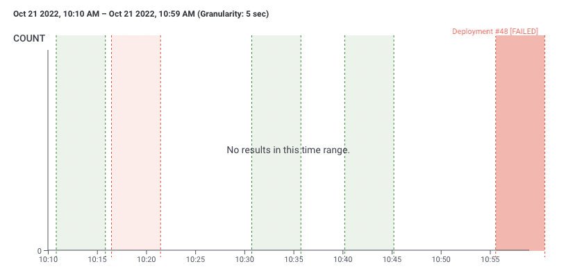

# gha-honeycomb-marker
Lightweight GitHub Action that lists, creates, updates, and deletes Honeycomb markers

This action allows to perform CRUD operations on [Honeycomb Markers API](https://docs.honeycomb.io/api/markers/) in an easy and user friendly manner.

Development in progress. Supported operations:

- [x] Create
- [ ] Read
- [x] Update
- [ ] Delete

## Usage

### Create a single marker

```
    - name: Honeycomb Start Marker
      uses: pawelros/gha-honeycomb-marker@v1.0.0 # please specify a version tag or sha
      with:
        api-key: ${{secrets.HONEYCOMB_API_KEY}}
        dataset: 'my-dataset'
        operation: 'create'
        type: 'deployment'
        message: 'Test marker!'
        url: "${{ github.server_url }}/${{ github.repository }}/actions/runs/${{ github.run_id }}"
```

### Create a marker representing a time range, such as a 5 minute deploy

```
    - name: Honeycomb Start Marker
      id: start_marker
      uses: pawelros/gha-honeycomb-marker@v1.0.0
      with:
        api-key: ${{secrets.HONEYCOMB_API_KEY}}
        dataset: 'my-dataset'
        operation: 'create'
        type: 'deployment'
        message: "Deployment #${{ github.run_number }}"
        url: "${{ github.server_url }}/${{ github.repository }}/actions/runs/${{ github.run_id }}"
    - name: Deploy my great app
      run: |
        echo "Deployment in progress..."
        sleep 300s
        echo "DEPLOY_DONE_TIMESTAMP=$(date +'%s')" >> $GITHUB_ENV
        echo "Deployment has finished."
      shell: bash
    - name: Honeycomb End Marker
      if: always()
      uses: pawelros/gha-honeycomb-marker@v1.0.0
      with:
        api-key: ${{secrets.HONEYCOMB_API_KEY}}
        operation: 'update'
        id: ${{steps.start_marker.outputs.id}}
        dataset: 'my-dataset'
        end-time: ${{env.DEPLOY_DONE_TIMESTAMP}}
```


### A more advanced deployment marker with type dependent on build success (or failure)

```
    - name: Honeycomb Start Marker
      id: start_marker
      uses: pawelros/gha-honeycomb-marker@v1.0.0
      with:
        api-key: ${{secrets.HONEYCOMB_API_KEY}}
        dataset: "my-dataset"
        operation: "create"
        type: "deployment_in_progress"
        message: "Deployment #${{ github.run_number }}"
        url: "${{ github.server_url }}/${{ github.repository }}/actions/runs/${{ github.run_id }}"
    - name: Deploy my great app
      run: |
        echo "Deployment in progress..."
        sleep 300s
        echo "DEPLOY_DONE_TIMESTAMP=$(date +'%s')" >> $GITHUB_ENV
        echo "Deployment has finished."
      shell: bash
    - name: Honeycomb End Marker
      if: always()
      uses: pawelros/gha-honeycomb-marker@v1.0.0
      with:
        api-key: ${{secrets.HONEYCOMB_API_KEY}}
        operation: "update"
        id: ${{steps.start_marker.outputs.id}}
        dataset: "my-dataset"
        type: ${{job.status == 'success' && 'deployment_ok' || 'deployment_failed' }}
        message: ${{job.status == 'success' && format('Deployment #{0} [OK]', github.run_number) || format('Deployment #{0} [FAILED]', github.run_number)}}
        end-time: ${{env.DEPLOY_DONE_TIMESTAMP}}
```




## Input parameters

| Name        | Required           | Description  |
| ------------- |:-------------:| -----:|
| api-key      | true | Honeycomb API Key. The API key must have the Manage Markers permission. |
| dataset      | true |   Honecomb dataset |
| operation    | true |  one of `Create`, `Read`, `Update`, `Delete` |
| id           | true if operation is `Update` or `Delete`, otherwise false | Honeycomb marker id for update and delete operation.|
| type         | true | A string grouping similar Markers, eg "deploys". All Markers of the same type will appear in the same color on the graph. |
| message      | true | A string describing this specific Marker. This string will appear above the Marker line on a graph. |
| start-time   | false | Indicates the time the Marker should be placed. If missing, defaults to the time the request arrives at the API. Expressed in Unix Time, aka seconds since the epoch. |
| end-time     | false | Specifying end time will allow you to record a Marker representing a time range, such as a 5 minute deploy. This range will be highlighted when rendering a graph. Expressed in Unix Time, aka seconds since the epoch. |
| url |        | false | A target for the Marker. If you click on the Marker text, it will take you to this URL. For a deploy, this field might be a link to the build system showing the build log for the version that was deployed. |
| treat-missing-dataset-as-warning | false | If set to `true`, a `404 dataset not found` error returned by Honeycomb API will be treated as warning, generate a warning annotation and return exit code 0 instead an error. |


Action is written in JavaScript as it simplifies the action code and executes faster than a Docker container action, see more [here](https://docs.github.com/en/actions/creating-actions/about-custom-actions#javascript-actions).